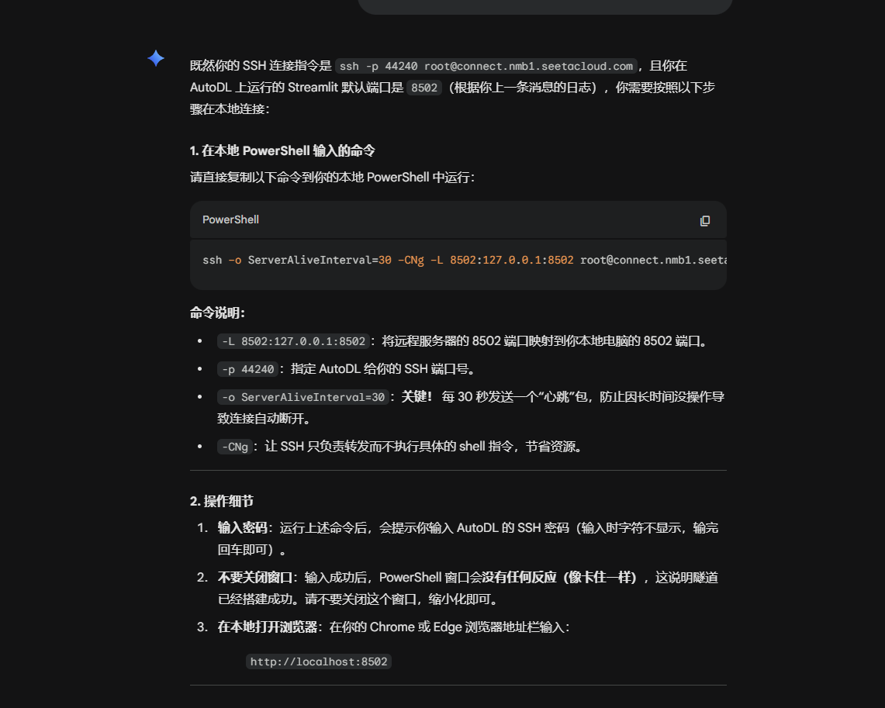
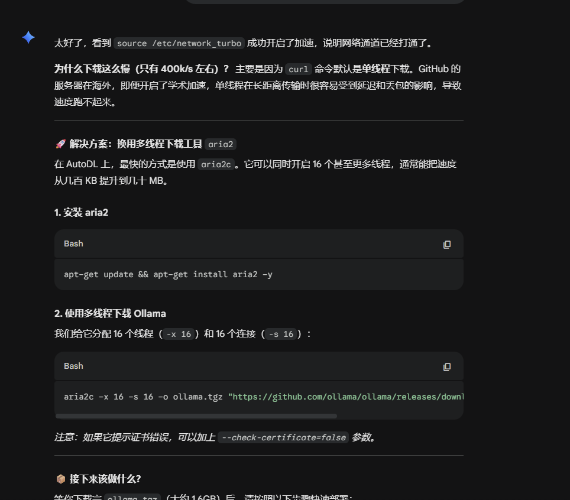
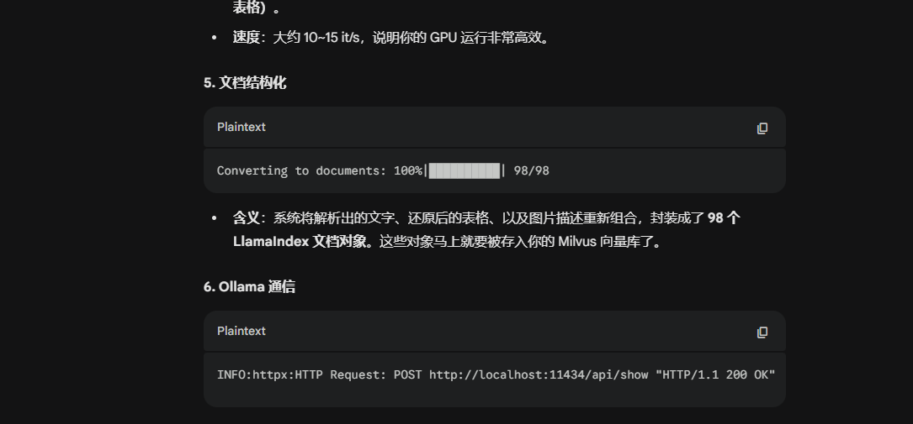

autodl上运行的网页可以通过在终端输出包持续链接

ssh -o ServerAliveInterval=30 -CNg -L 8501:127.0.0.1:8501 root@connect.nmb1.seetacloud.com -p 38593

然后输入http://localhost:8502进行查看

加速下载

$env:HTTPS_PROXY="http://127.0.0.1:7890"; npx create-astro@latest --template saicaca/fuwari

cpm

bge-m3

bge重排序模型

icdar19_modern如何下载。pth文件

加了国内OSos.environ["HF_ENDPOINT"] = "https://hf-mirror.com"在streamlit——app.py里面

释放显存

# 1. 寻找正在使用 nvidia 设备的进程 PID
python -c "import os; [os.system('kill -9 ' + line.split()[4]) for line in os.popen('nvidia-smi | grep python').readlines()]"

# 2. 如果上面没清干净，手动查看并 kill
nvidia-smi

使用步骤

1.由于向量数据库是安装在本地.db文件中所以不需要打开服务

2.打开nebula图形数据库操作步骤

cd /root/autodl-tmp/nebula-graph-3.6.0.el7.x86_64/scripts

./nebula.service start all

./nebula.service status all

3.打开OLLMA服务

ollama serve

ollama list

在src/chat_bot目录下

打开终端输入streamlit run streamlit_app.py

4.建立SSH链接代码如下在powershell中输入

ssh -o ServerAliveInterval=30 -CNg -L 8501:127.0.0.1:8501 root@connect.nmb1.seetacloud.com -p 19162 

ssh -p 19162 root@connect.nmb1.seetacloud.com