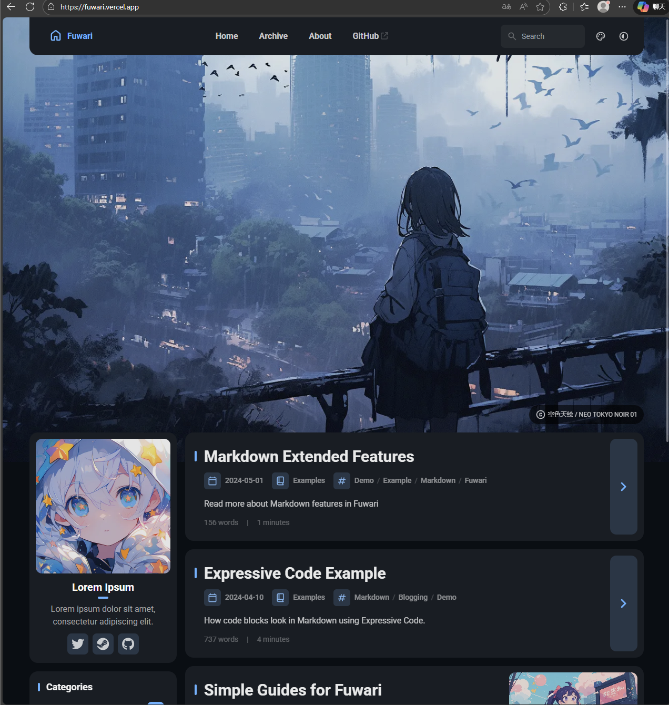

### 1. 后端 (Twikoo-pro) 的要求

在 Vercel 上运行时，它对环境有自动适配，但如果你要在本地调试这个后端，要求如下：

- **Node.js 版本**: 推荐使用 **Node.js 18.x** 或 **20.x**。Vercel 目前默认支持 Node.js 20。
- **npm 版本**: 随 Node.js 安装的默认版本即可（通常是 9.x 或 10.x）。

------

### 2. 前端 (Fuwari / Astro 博客) 的要求

Astro 是一个现代化的框架，对环境要求较高：

- **Node.js 版本**: 必须是 **v18.17.1**、**v20.3.0** 或更高版本。
  - **原因**: 低版本的 Node.js 无法解析 Astro 的一些高级语法，会导致你运行 `npm run dev` 时直接报错。
- **包管理器 (npm/pnpm)**:
  - 虽然可以使用 `npm`，但从你的项目截图看，仓库里包含 `pnpm-lock.yaml` 文件。
  - **强烈建议**: 使用 **pnpm**。Fuwari 主题官方通常推荐 pnpm 以获得更快的构建速度。
  - **安装命令**: `npm install -g pnpm`。

------

### 3. 如何检查你现在的版本？

在你的本地终端（就是你执行 `git add .` 的那个窗口）输入以下命令查看：

Bash

```
# 检查 Node.js 版本
node -v

# 检查 npm 版本
npm -v
```


### 1. 主题信息与下载地址

- **主题名称**：Fuwari
- **GitHub 下载地址**：https://github.com/saicaca/fuwari
- **在线演示（Demo）**：https://fuwari.vercel.app/
- 

这个主题自带了的**侧边栏统计、分类标签、日历（需要插件）、以及非常精美的卡片流布局**。

------

### 2. 如何使用到这个新主题？

1. **新建仓库**：建议你在电脑上新建一个文件夹，运行以下命令来安装这个新主题：

   ```Bash
   npx create-astro@latest --template saicaca/fuwari
   ```


基本知识了解

**Astro** 是一个目前在前端圈非常火的**现代网站构建框架**。

如果把做一个博客比作盖房子，传统的工具可能让你连砖头都要自己烧，而 Astro 就像是一个**高级的积木组装台**。

以下是它最核心的几个特点，决定了为什么大家喜欢用它做博客：

### 1. 速度极快（“零 JavaScript” 理念）

传统的框架（如 React 或 Vue）生成的网页，在浏览器打开时会加载大量的 JS 代码，导致手机访问变慢。

- **Astro 的做法：** 在你“盖房子”（构建阶段）时，它就把所有内容都变成了纯 HTML 网页。
- **结果：** 网页加载就像闪电一样快，因为浏览器只需要读取最简单的文字和图片，不需要运行复杂的程序。

### 2. 它是“全能翻译官”（多框架支持）

这是 Astro 最酷的地方。如果你以后想用 React 做个交互按钮，用 Vue 做个表格，或者用 Svelte 做个动画，Astro 允许你在**同一个项目**里同时使用它们。

- 你不需要为了换个组件就把整个网站推倒重来。

### 3. 内容驱动（天生为博客而生）

Astro 特别擅长处理 **Markdown** 文件。

- 对于博主来说，你只需要在 `src/content/blog` 文件夹里丢进一个 `.md` 文档（就像写记事本一样），Astro 就会自动帮你生成精美的网页、列表、分类和 RSS 订阅。

### 4. 岛屿架构（Islands Architecture）

这是它的独门绝技。如果你的网页大部分是静态文字（比如文章），只有一小块需要交互（比如一个点赞按钮），Astro 只会给那个“小岛”（按钮）发送 JS 代码，页面的其他部分保持纯静态。

------

### 总结

**Astro 就像是一个超级编译器：**

- **输入：** 你的 Markdown 文章 + 简单的模板代码。
- **输出：** 一个运行极快、SEO（搜索引擎排名）极好、且完全不需要数据库的**静态网站**


将代码部署到GitHub Pages操作步骤

第一步：修改配置文件

1.在 VS Code 中打开 `astro.config.mjs`

2.修改其中的 `site` 和 `base`

```javascript
import { defineConfig } from 'astro/config';

export default defineConfig({
  // 这里的 username 换成你的 GitHub 用户名
  // 这里的 my-blog 换成你准备在 GitHub 创建的仓库名
  site: 'https://username.github.io',
  base: '/my-blog', 
  integrations: [mdx(), sitemap(), tailwind()],
});
```

第二步：创建 GitHub 仓库并上传代码

登录 [GitHub](https://github.com/)，点击右上角 `+` -> **New repository**。

**Repository name** 填写 `my-blog`（和上一步的 base 保持一致）。

保持公开（Public），点击 **Create repository**。

在你的本地电脑终端执行以下命令（将代码推送到 GitHub）：

```bash
git add .
git commit -m "首次部署博客"
git branch -M main
# 这里的 URL 换成你刚才在 GitHub 网页上看到的那个链接
git remote add origin https://github.com/你的用户名/my-blog.git
git push -u origin main
```

### 第三步：配置 GitHub 自动部署 (GitHub Actions)

GitHub Pages 现在支持通过 **GitHub Actions** 自动构建 Astro 项目，这是最省心的方式。

1. 在 GitHub 网页上进入你的仓库，点击顶部的 **Settings**。

2. 在左侧边栏找到 **Pages** 选项。

3. 在 **Build and deployment** 下方的 **Source** 菜单中，选择 **GitHub Actions**。

4. 然后回到GitHub 网页上进入你的仓库,点击顶部的 **ACTIONS**。

5. 在搜索框中选中Deploy Astro site点击配置即可

6. 再次提交代码：

   ```bash
   git add .
   git commit -m "添加部署脚本"
   git push
   ```